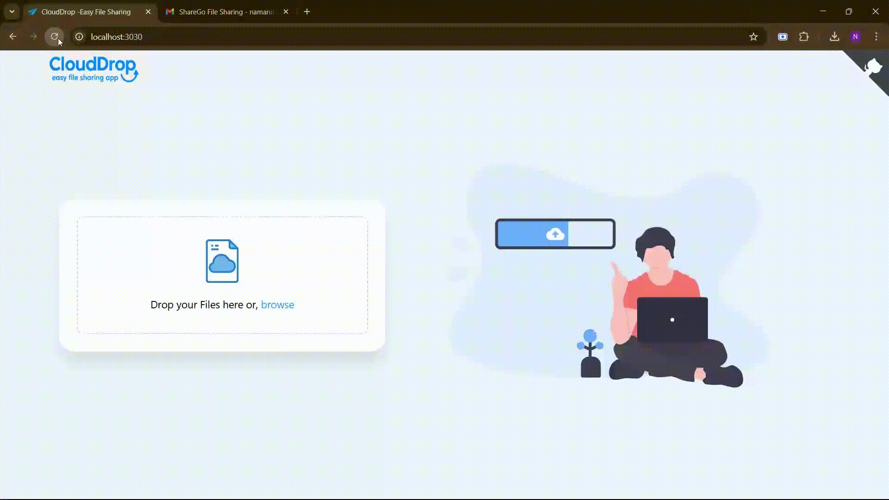

---

# CloudDrop – A Secure and Efficient file-sharing

A web application built with **Node.js**, **Express**, and **MongoDB** (with a vanilla JavaScript frontend) that lets users drag & drop or select a file to upload, monitor upload progress, generate a unique download link, optionally email that link, and automatically deletes files and database records older than 24 hours.  

---

## 🎬 Demo



---

## ✨ Features

- **Drag & Drop Upload** using HTML5 Drag and Drop API   
- **File Input Fallback** for browsers without drag & drop support   
- **Upload Progress Bar** via `XMLHttpRequest` progress events   
- **Unique Download Link** generated with UUID to prevent guessing   
- **Copy URL to Clipboard** for easy sharing   
- **Email Sharing**: Send the download link by email using Nodemailer   
- **Client-side Validation** (single file, up to 100 MB)   
- **Auto-Delete After 24 Hours** both file and metadata via a scheduler   
- **Responsive UI**, mobile-friendly design   

---

## 🛠 Tech Stack

- **Frontend**  
  - HTML5, CSS3 (variables, Flexbox)  
  - Vanilla JavaScript (no frameworks)  
- **Backend**  
  - Node.js, Express.js  
  - Multer for handling multipart/form-data (file uploads)   
  - MongoDB (Mongoose ODM) for storing file metadata   
  - uuid for unique file identifiers   
  - Cors for cross-origin requests  
  - dotenv for environment variable management   
- **Email**  
  - Nodemailer for SMTP delivery  
- **Task Scheduling**  
  - node-cron (or Heroku Scheduler) for periodic cleanup  

---

## 🔧 Prerequisites

- [Node.js](https://nodejs.org/) (v14+) & npm or Yarn  
- MongoDB Atlas account or local MongoDB instance  
- SMTP-capable email account (e.g., Gmail, SendGrid)  
- (Optional) Heroku account for deployment & scheduler  

---

## 🚀 Installation

1. **Clone the repository**  
   ```bash
   git clone https://github.com/namaniisc/CloudDrop.git
   cd CloudDrop
   ```

2. **Install dependencies**  
   ```bash
   npm install
   # or
   yarn install
   ```

3. **Create necessary directories**  
   ```bash
   mkdir uploads logs
   ```

4. **Configure environment variables** (see [Environment Variables](#environment-variables))  

5. **Run in development mode**  
   ```bash
   npm run dev
   ```

---

## 🔐 Environment Variables

Create a `.env` file in the project root with the following entries:

```dotenv
# MongoDB connection
MONGO_URI=<your-mongodb-connection-string>

# App configuration
PORT=5000                     # Server port
BASE_URL=http://localhost:3000  # Frontend URL

# SMTP / Email settings
SMTP_HOST=smtp.example.com
SMTP_PORT=587
SMTP_USER=youremail@example.com
SMTP_PASS=yourEmailPassword
EMAIL_FROM=no-reply@your-domain.com
```

---

## ▶️ Usage

- **Frontend**  
  ```bash
  cd frontend
  npm install
  npm start
  ```
  - Visit [http://localhost:3000](http://localhost:3000)  
  - Drag & drop or click “Browse” to select a file  
  - Watch the upload progress, then copy or email the generated link  

- **Backend**  
  ```bash
  cd backend
  npm install
  npm start
  ```
  - Express server starts on the port defined in `.env`  

---

## 📡 API Endpoints

| Method | Route                      | Description                                    |
| ------ | -------------------------- | ---------------------------------------------- |
| **POST** | `/api/files`               | Upload a single file (`multipart/form-data`)   |
| **POST** | `/api/files/send`          | Send the download link via email               |
| **GET**  | `/files/:uuid`             | Render download page for file with `<uuid>`    |
| **GET**  | `/files/download/:uuid`    | Trigger file download for file with `<uuid>`   |

---

## 📂 Folder Structure

```
├── backend/
│   ├── controllers/
│   │   ├── fileController.js
│   │   └── emailController.js
│   ├── models/
│   │   └── File.js
│   ├── routes/
│   │   └── files.js
│   ├── scripts/
│   │   └── cleanup.js          # Deletes files >24 hrs old
│   ├── uploads/                # Stored uploaded files
│   ├── logs/                   # Application logs
│   ├── server.js
│   └── package.json
├── frontend/
│   ├── public/
│   ├── src/
│   ├── index.html
│   └── package.json
├── .env
└── README.md
```

---

## ⏲ Auto-Deletion Scheduler

A cleanup script removes both files and database records older than 24 hours:

```js
// backend/scripts/cleanup.js
const File = require('../models/File');
const fs = require('fs');
const path = require('path');

async function cleanOldFiles() {
  const cutoff = Date.now() - 24 * 60 * 60 * 1000;
  const oldFiles = await File.find({ createdAt: { $lt: cutoff } });
  for (const file of oldFiles) {
    fs.unlinkSync(path.join(__dirname, '../uploads', file.filename));
    await File.deleteOne({ _id: file._id });
  }
  console.log('Cleanup complete');
  process.exit(0);
}

cleanOldFiles();
```

- **Scheduling**:  
  - **node-cron**: Add a cron job in your server code.  
  - **Heroku Scheduler**: `Command: node backend/scripts/cleanup.js` at 2 AM daily.

---

## ☁️ Deployment

1. **Push to GitHub**  
2. **Create a new app** on your chosen host (e.g., Heroku, DigitalOcean)  
3. **Set environment variables** via the provider’s dashboard  
4. **Enable scheduler** (Heroku Scheduler or system cron)  
5. **Deploy** via GitHub integration or CLI  

---

## 🤝 Contributing

1. Fork the repository  
2. Create a branch: `git checkout -b feature/YourFeature`  
3. Commit: `git commit -m "Add YourFeature"`  
4. Push: `git push origin feature/YourFeature`  
5. Open a Pull Request  

